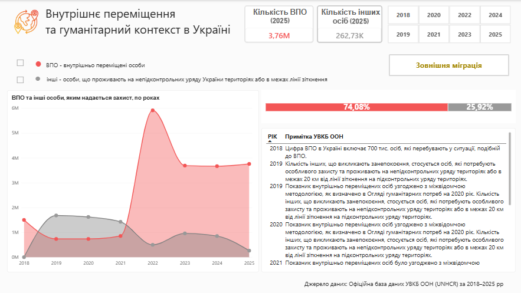
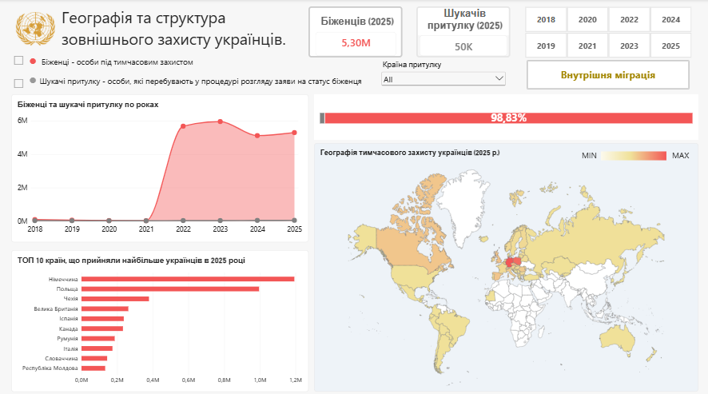

# Ukraine Displacement Dashboard

Analysis and interactive dashboard on forced displacement of the Ukrainian population (internally displaced persons and refugees abroad), 2018–2025, based on UNHCR data.

The project covers a full data pipeline: cleaning and translating raw UNHCR data → data quality audit and aggregation → interactive visualization in Power BI.

**🔗 [View the live dashboard](https://app.powerbi.com/view?r=eyJrIjoiN2RmMWE3NTMtYjY5ZS00NDRkLTk2ZWUtNzgyNTU4Y2FjZGFkIiwidCI6IjQ0NTE4MjdkLTljYmQtNGM1OS1iZmU2LThiNTBiODJkMDBlMCJ9)** — no download or Power BI installation required.

---

## Data Source

Data downloaded from Kaggle:
**Global Refugee and Displacement (UNHCR, 2018–2025)**
Author: Mehmet Can Şahin
Link: https://www.kaggle.com/datasets/mehmetcansahinn/global-refugee-and-displacement-unhcr-2018-2025
License: CC BY 4.0

Original data provided by UNHCR (UN Refugee Agency).

---

## Repository Structure

```
ukraine-displacement-dashboard/
├── data/
│   ├── raw/                  # Raw data from Kaggle (unchanged)
│   │   ├── footnotes.csv
│   │   └── persons_of_concern.csv
│   ├── translated/           # Data with translated footnotes and country names
│   │   ├── footnotes_perfect_ukr.csv
│   │   └── persons_of_concern_ukr.csv
│   └── processed/            # Final aggregated tables for Power BI
│       ├── BI_ukrainian_notes.csv
│       ├── BI_ukrainian_idps.csv
│       └── BI_ukrainian_abroad_final.csv
├── notebooks/
│   ├── 01_translation.ipynb              # Translation of footnotes and country names
│   └── 02_analysis_and_export.ipynb      # Filtering, audit, aggregation, visualization
├── dashboard/
│   └── UA_migrants_IDP.pbix
├── dashboard_screenshots/
│   ├── Page1_humanitarian_context_in_Ukraine.png
│   └── Page2_external_protection_for_Ukrainians.png
└── README.md
```

---

## Pipeline Overview

**1. Translation** (`01_translation.ipynb`)
UNHCR footnotes (`Footnote`) and country-of-asylum names are translated from English to Ukrainian using Google Translate (`deep_translator`). The result is saved to `data/translated/`.

> **Note:** access to Google Translate via `deep_translator` is unofficial (not a paid, key-based API), so it sometimes requires several attempts due to temporary rate limiting on Google's side. This is a known limitation of the tool, not a code error.

**2. Analysis and Data Preparation** (`02_analysis_and_export.ipynb`)
- Filtering data related to Ukraine (internal displacement and displacement abroad);
- Data quality audit (duplicates, missing values, anomalous values, validation of the `Year` column format);
- Expanding footnotes covering year ranges (e.g. "2019-2020") into individual per-year records;
- Adding UN M49 numeric country codes for geographic visualization;
- Aggregation and export of three final tables into `data/processed/`.

**3. Visualization** (`dashboard/UA_migrants_IDP.pbix`, also [available online](https://app.powerbi.com/view?r=eyJrIjoiN2RmMWE3NTMtYjY5ZS00NDRkLTk2ZWUtNzgyNTU4Y2FjZGFkIiwidCI6IjQ0NTE4MjdkLTljYmQtNGM1OS1iZmU2LThiNTBiODJkMDBlMCJ9))
An interactive Power BI dashboard with two pages:
- **Internal migration** — trends in IDPs (internally displaced persons) and other people of concern (OOC) for 2018–2025;
- **External migration** — trends in refugees and asylum seekers, geographic distribution by country of asylum, top 10 destination countries.

---

## Key Insights

- As of 2025, Ukraine has 3.7 million internally displaced persons (IDPs) and 262,000 people of concern who live in areas outside government control or within 20 km of the contact line in government-controlled areas.
- Between 2018 and 2021, the UN recorded a gradual decrease and only minor fluctuations in the number of actual IDPs, reflecting long-term integration. Following Russia's full-scale invasion in 2022, the UN recorded up to 6 million IDPs (up to 8 million in early spring 2022). By 2023, this figure had fallen to 3.7 million, as part of the population moved abroad or returned home.
- In 2025, Germany hosted the largest number of Ukrainian refugees (1.2 million), followed by Poland (995,000) and Czechia (378,000). Russia led in 2022–2023 with a figure of around 1.2 million, but this figure included not only people with official refugee or temporary asylum status, but also individuals registered under other forms of stay. Since this data was not updated after mid-2023, UNHCR excluded it from official statistics — and by the end of 2024, the figure for Russia stood at only 6,894 people (official refugee/temporary asylum status only).

---

## Tools

Python (pandas, deep_translator, pycountry, matplotlib, seaborn, plotly) · Power BI

---

## Dashboard Screenshots

### Internal Migration


### External Migration

